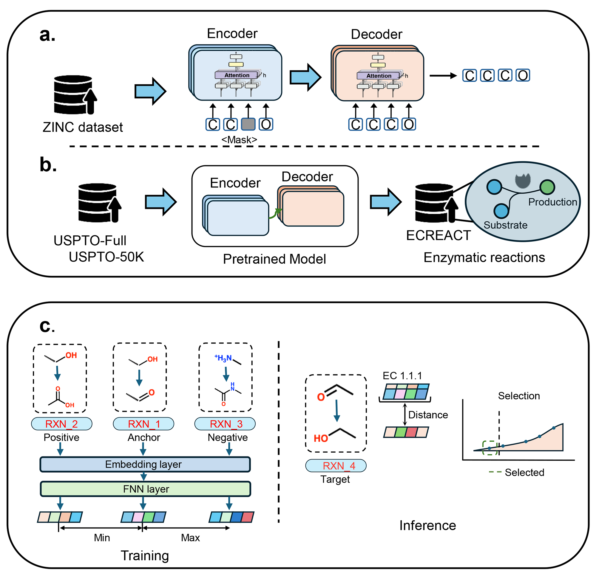

# Enzyformer
Enzyformer is a **Two-Stage Pretrained Model for Enzymatic Retrosynthesis**.


## 🧪 Enzyformer - Colab Development Notebook

We have set up a simple ​**Google Colab notebook**​ to help users quickly get started with ​**Enzyformer**.

### 🔗 Notebook Link

👉 [Open Enzyformer Colab Notebook](https://colab.research.google.com/drive/1dE9Ch7XgBLtsF2Q3EYtFkDHeXVjieTye?usp=sharing)

### ✅ What is this for?

This Colab notebook provides a ​**ready-to-run environment**​ where you can:

- Use or experiment with the ​**Enzyformer**​ model
- Quickly test functionalities without needing to set up a local machine
- Ideal for quick prototyping, demos, or educational purposes


## Environment Setup

### 1. Enzymatic Retrosynthesis

```bash
mamba create -n enzymeformer_retro python=3.7
mamba activate enzymeformer_retro
pip install torch==1.9.0+cu111 torchvision==0.10.0+cu111 torchaudio==0.9.0 -f https://download.pytorch.org/whl/torch_stable.html
pip install rdkit-pypi==2022.9.4
pip install hydra-core --upgrade
pip install pandas
pip install pytorch-lightning==1.2.3
pip install git+https://github.com/MolecularAI/pysmilesutils.git
```

### 2. Enzyme Assignment
Create a dedicated environment and install required packages:

```bash
# Create a Python 3.10 environment
mamba create -n enzymeformer_ec python=3.10
mamba activate enzymeformer_ec

# Install PyTorch and corresponding CUDA (adjust based on your GPU)
pip install torch==2.7.0 torchvision==0.22.0 torchaudio==2.7.0 \
    --index-url https://download.pytorch.org/whl/cu128

# Install DGL (Deep Graph Library)
pip install dgl -f https://data.dgl.ai/wheels/torch-2.4/cu124/repo.html --no-deps

# Install rxnfp for reaction fingerprints
pip install rxnfp==0.1.0 --no-deps

# Install Hugging Face Transformers
pip install transformers

# Install Simple Transformers
pip install simpletransformers

pip install rdkit-pypi==2022.9.4
pip install drfp --no-deps
pip install "numpy<2" --force-reinstall
```

## Retrosynthesis Prediction

### Data Preparation
1. **Download dataset**  
   [Google Drive Dataset](https://drive.google.com/drive/folders/14rY863a-qdngGUnbF6BB7OJEJ8X6Sv5x?usp=drive_link)  
   Place all files in `./Retrosynthesis/data`.

2. **Download pretrained checkpoints**  
   [Google Drive Checkpoints](https://drive.google.com/drive/folders/1hWeqqLjWYTOrwrvg1P3k7Uj8QyJ5US0o?usp=drive_link)  
   Place all files in `./Retrosynthesis/ckpt`.

---

### Training and Inference

Run the following commands for **training the model if needed** and **direct inference on Enzyformer**:

```bash
cd ./Chemformer

# Train the model (if needed)
bash ../Retrosynthesis/finetune-backward.sh

# Or directly run inference on Enzyformer
bash ../Retrosynthesis/finetune-direct.sh

# Score predictions
python score_predictions.py \
    -mode 2 \
    -beam_size 10 \
    -n_best 10 \
    -augmentation 1 \
    -targets ./retrosyntheis/data/test.targets.txt \
    -process_number 8 \
    -score_alpha 1 \
    -save_file ./retrosyntheis/otuputs/final_results_mode_5_wo.txt \
    -detailed \
    -source ./retrosyntheis/data/test.sources.txt
```
## EC number assignment

### Data preparation

1. **Download dataset**  
   [Google Drive Dataset](https://drive.google.com/drive/folders/1lePKa3Y4owkjxZZqNbhmmQf_qf-0O3dv?usp=drive_link)  
   Place all files in `./Ec_assignment/data/distance_map`.

   [Google Drive Dataset](https://drive.google.com/drive/folders/1okqhBcvI0miXXKArDw09YIk8_50pWzTj?usp=drive_link)  
   Place all files in `./Ec_assignment/data`.
   
   

2. **Download pretrained checkpoints**  
   [Google Drive Checkpoints](https://drive.google.com/drive/folders/1p0dduOtna4KLzQcVpfrOGRlP4JZ1NNU-?usp=drive_link)  
   Place all files in `./Ec_assignment/data/model`.

### first ec level
```bash
cd Ec_assignment
python preprocess.py --rank first --fingerprint rxnfp
python train-triplet.py --training_data rxn_first --model_name rxn_first_triplet --epoch 500000 --fingerprint rxnfp
python inference_rxn.py --rank first --infer_mode max --train_mode triplet --fingerprint rxnfp
```

### second ec level
```bash
python preprocess.py --rank second --fingerprint rxnfp
python train-triplet.py --training_data rxn_second --model_name rxn_second_triplet --epoch 500000 --fingerprint rxnfp
python inference_rxn.py --rank second --infer_mode max --train_mode triplet --fingerprint rxnfp
```

### third ec level
```bash
python preprocess.py --rank third --fingerprint rxnfp
python train-triplet.py --training_data rxn_third --model_name rxn_third_triplet --epoch 500000 --fingerprint rxnfp
python inference_rxn.py --rank third --infer_mode max --train_mode triplet --fingerprint rxnfp
```


